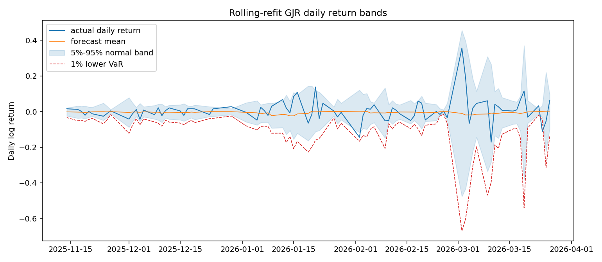
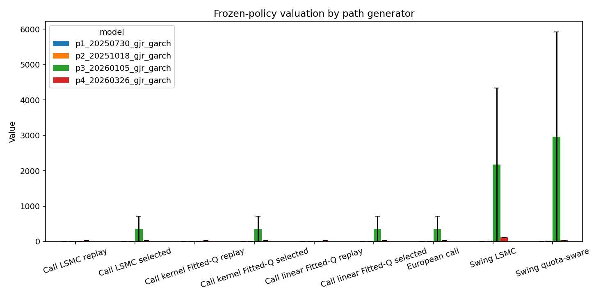
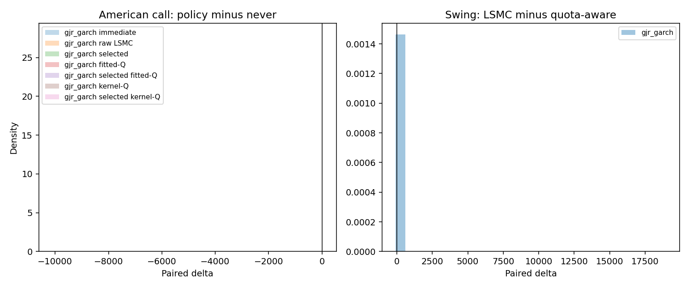
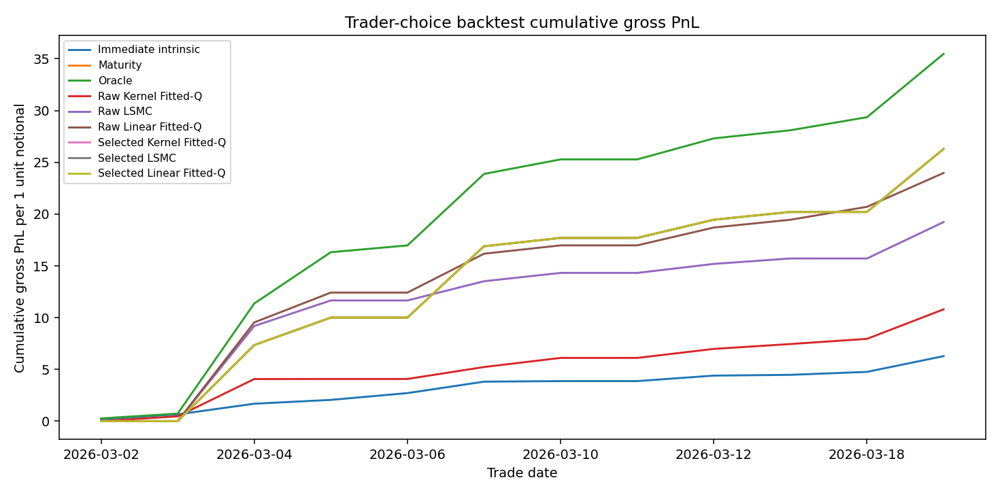
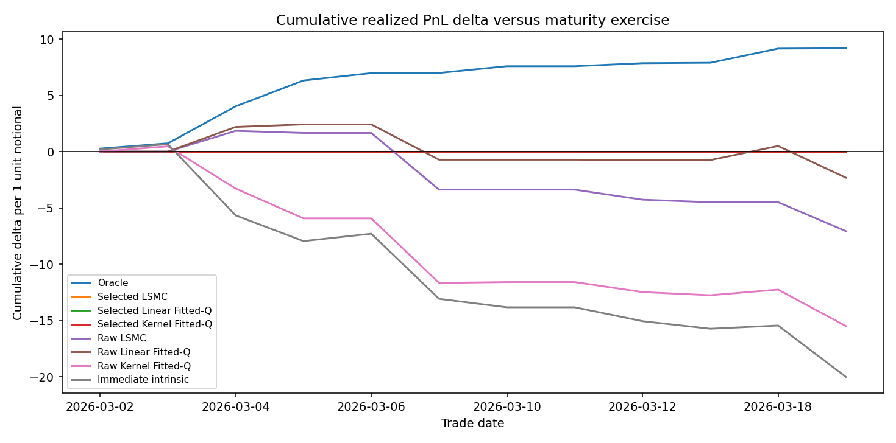
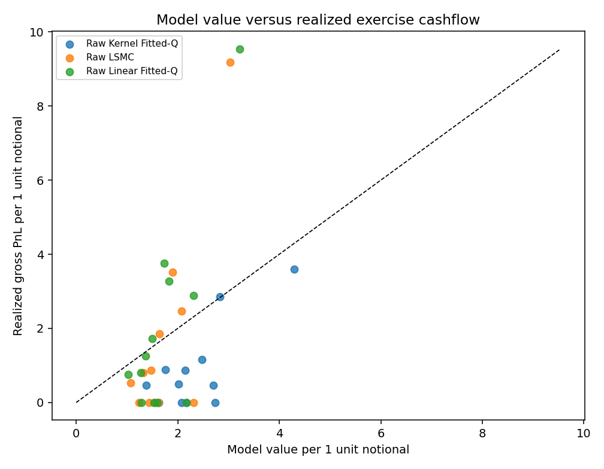

# LSMC vs Reinforcement Learning

This repository builds a reproducible research and engineering baseline for
Longstaff-Schwartz Monte Carlo (LSMC), approximate dynamic programming (ADP),
and later reinforcement-learning methods. The current codebase is not yet a
complete option or RL engine. It provides the data, volatility-modeling, path
simulation, and first valuation building blocks needed for a fair comparison.

## TL;DR

The most useful result so far is the Historical Trader Choice Backtest. It is
not a risk-neutral fair-value test and should not be read as a market-consistent
option price. It asks a different question from a risk taker's perspective: if a
trader owned a daily ATM American put exercise right on realized `FRONT` prices
and had to choose between maturity exercise, LSMC, or RL/ADP exercise policies,
which rule would have produced better realized cashflows?

On the current `2026-03-02` to `2026-03-19` sample, the answer is conservative:
simple maturity exercise is the best non-oracle deployable rule with
cost-adjusted PnL `26.294498`. No raw learned policy has positive total edge
against maturity. Raw Linear Fitted-Q is least bad at `-2.319811` versus
maturity, Raw LSMC loses `-7.064674`, and Raw Kernel Fitted-Q loses
`-15.494576`.

The validation gate rejected every learned candidate in this sample. That is not
a failure of the gate; from a risk-taking deployment perspective it is the most
valuable finding. The gate avoids `24.879061` of realized underperformance
versus always deploying the raw learned candidates. The model-price diagnostics
also argue against using the current learned policies as valuation rules: Raw
Linear Fitted-Q has positive paper model-net PnL, but still overvalues realized
cashflow on `58.33%` of days, while Raw Kernel Fitted-Q is a clear valuation
failure with model value `28.228126` versus realized cashflow `10.799922`.

Practical interpretation: this project is currently better at identifying
unsafe exercise and valuation behavior than at producing a production-ready
learned valuation strategy. The next useful work is path realism, calibration of
model value versus realized cashflow, and stricter out-of-sample validation
before allowing learned policies to override maturity exercise.

## Working Asset

The current analysis uses TTF gas market data, a key European gas benchmark.
The available period includes the market phase around the 2026 Iran conflict,
where European gas and energy prices reacted strongly according to market
reports. This makes the dataset a deliberate stress test for future LSMC and
reinforcement-learning approaches: the models should not only work on smooth toy
data, but also under jumpy, geopolitically driven volatility regimes.

There is no special economic reason why this asset was selected as the primary
research case. The series represents the TTF front-month contract, and it was
chosen mainly because it is highly volatile. That volatility makes it a useful
hard test for path generation, exercise logic, policy evaluation, and later
LSMC-vs-RL comparisons.

## Current Implementation

- Read-only data loader with schema, OHLC, duplicate, and gap checks.
- Log-return calculation without lookahead.
- GJR-GARCH(1,1) model for intraday volatility.
- HAR-RV model for daily realized variance diagnostics. It is no longer used in
  the active valuation or policy-evaluation reports.
- Monte Carlo path interface with `path`, `step`, `time`, `price`, `return`,
  `variance`, `volatility`, and `model`.
- LSMC valuation modules for the active American call report and a first
  gas-style swing option.
- Offline RL/ADP baselines for American optimal stopping: linear Fitted-Q and
  random-Fourier-feature kernel Fitted-Q.
- Frozen-policy evaluation layer with pathwise values, paired deltas, bootstrap
  confidence intervals, CVaR, constraint diagnostics, and baseline policies for
  American and swing options.
- Validation-selected deployment wrappers that keep raw learned candidates
  visible but fall back to never-exercise unless independent validation clears
  the configured mean and left-tail gates.
- Analysis CLIs for rolling GARCH refits, daily realized-variance diagnostics,
  distributional path-quality diagnostics, diagnostic LSMC option valuation,
  paired frozen-policy evaluation, and historical trader-choice backtesting.
- Historical backtest outputs now include gross PnL, cost-adjusted PnL,
  model-net PnL, validation deploy rates, oracle regret, and daily drawdown
  diagnostics.

## Running The Code

Install the package in editable mode:

```powershell
python -m pip install -e .
```

Generate GJR-GARCH paths:

```powershell
python -m lsmc_rl.simulation.paths --config configs/mc_paths_front.yaml
```

Run the rolling-refit GJR-GARCH analysis:

```powershell
python -m lsmc_rl.analysis.garch_refit_report --output-dir outputs/garch_refit_report_front --report-path docs/garch_refit_analysis.md
```

Run the distributional path-quality report:

```powershell
$env:PYTHONPATH='src'
python -m lsmc_rl.analysis.path_quality_report --output-dir outputs/path_quality_report_front --report-path docs/path_quality_analysis.md
```

Run the diagnostic American/swing LSMC valuation report:

```powershell
$env:PYTHONPATH='src'
python -m lsmc_rl.analysis.option_lsmc_report --output-dir outputs/option_lsmc_report_front
```

Run the frozen-policy evaluation report:

```powershell
$env:PYTHONPATH='src'
python -m lsmc_rl.analysis.policy_evaluation_report --output-dir outputs/policy_evaluation_front
```

Run the historical trader-choice backtest:

```powershell
$env:PYTHONPATH='src'
python -m lsmc_rl.analysis.trader_choice_backtest --output-dir outputs/trader_choice_backtest_front
```

## Path Quality Diagnostics

The primary path-quality analysis is stored in
[docs/path_quality_analysis.md](docs/path_quality_analysis.md). It evaluates
GJR-GARCH and HAR-RV with professional distributional scores rather than
point-forecast summaries. Lower values are better for all scores in the table.

| model | QLIKE | Gaussian NLL | Energy Score | multiband MMD^2 |
| --- | ---: | ---: | ---: | ---: |
| GJR-GARCH | `-4.668053` | `-1.388606` | `3.920006` | `0.356907` |
| HAR-RV | `231.368793` | `40.844925` | `135.499740` | `0.430470` |

GJR-GARCH is the stronger path generator on this diagnostic run: it wins on
QLIKE, Gaussian NLL, Energy Score, and aggregate multiband MMD. HAR-RV is
particularly weak on QLIKE/NLL and Energy Score, which indicates that its daily
variance forecasts and simulated daily path-feature distribution are too far
from the observed stress-period behavior.

The multiband MMD report also breaks the discrepancy down into core return and
volatility features, extreme-path features, and multi-horizon return/variance
bands.

| model | core MMD^2 | extremes MMD^2 | multi-horizon MMD^2 | aggregate MMD^2 |
| --- | ---: | ---: | ---: | ---: |
| GJR-GARCH | `0.482634` | `0.361964` | `0.226124` | `0.356907` |
| HAR-RV | `0.453582` | `0.473121` | `0.364707` | `0.430470` |

Practical assessment: GJR-GARCH currently produces the more realistic paths for
this dataset and stress period. HAR-RV should not be used as the primary path
generator before its variance dynamics and simulated path-feature distribution
are improved.

Auxiliary rolling-refit GJR-GARCH stress-period visual check:



## LSMC Valuation For American And Swing Options

The active valuation report now focuses on American calls and the gas-style
swing call. Put options and HAR-RV simulations are excluded from the generated
valuation report. The reusable valuation modules still contain broader option
building blocks, but the current research comparison is Call-only/GJR-GARCH.

Implemented report components:

- American call LSMC via Longstaff-Schwartz backward induction with ridge
  regression, moneyness, intrinsic-value, and volatility features.
- American call RL/ADP baselines via linear Fitted-Q and kernel Fitted-Q.
- Frozen American policies replayed on independent evaluation paths.
- Validation-selected deployment wrappers chosen on independent validation
  paths against the European never-exercise baseline.
- A gas-style swing call with discrete remaining-volume state, period limits,
  total volume band, and state-dependent continuation-value regression.

The report trains raw LSMC, linear Fitted-Q, and kernel Fitted-Q candidates on
independent generated paths, validates deployment on separate validation paths,
and replays both raw and selected policies on report paths. The selected
deployment line may fall back to never-exercise and therefore equal the European
baseline by construction; it is not a pure model value. No American replay is
floored path by path or replaced with a pathwise maximum against the European
payoff.

```powershell
$env:PYTHONPATH='src'
python -m lsmc_rl.analysis.option_lsmc_report --output-dir outputs/option_lsmc_report_front
```

Setup: `FRONT`, `5m`, GJR-GARCH only, `4` rolling historical calibration
windows of `120` calendar days, `2048` evaluation paths, `2048` LSMC training
paths, `2048` LSMC validation paths, `2048` RL training paths and `2048` RL
validation paths per window, `288` steps, ATM strike per window, bootstrap seed
`20260520`.

| period | candidate | raw replay | European | raw-Euro | bound check | selected policy | deployment |
| --- | --- | ---: | ---: | ---: | --- | --- | ---: |
| p1_20250730 | LSMC | `1.049962` | `0.928168` | `0.121794` | ok | never-exercise fallback | `0.928168` |
| p1_20250730 | linear Fitted-Q | `1.083193` | `0.928168` | `0.155025` | ok | candidate | `1.083193` |
| p1_20250730 | kernel Fitted-Q | `0.859582` | `0.928168` | `-0.068586` | policy failure | never-exercise fallback | `0.928168` |
| p2_20251018 | LSMC | `0.801083` | `1.956737` | `-1.155654` | policy failure | never-exercise fallback | `1.956737` |
| p2_20251018 | linear Fitted-Q | `1.907171` | `1.956737` | `-0.049567` | policy failure | never-exercise fallback | `1.956737` |
| p2_20251018 | kernel Fitted-Q | `1.348481` | `1.956737` | `-0.608256` | policy failure | never-exercise fallback | `1.956737` |
| p3_20260105 | LSMC | `0.972206` | `359.142149` | `-358.169943` | policy failure | never-exercise fallback | `359.142149` |
| p3_20260105 | linear Fitted-Q | `1.242639` | `359.142149` | `-357.899511` | policy failure | never-exercise fallback | `359.142149` |
| p3_20260105 | kernel Fitted-Q | `0.934432` | `359.142149` | `-358.207718` | policy failure | never-exercise fallback | `359.142149` |
| p4_20260326 | LSMC | `24.070479` | `24.720466` | `-0.649987` | policy failure | never-exercise fallback | `24.720466` |
| p4_20260326 | linear Fitted-Q | `24.307201` | `24.720466` | `-0.413265` | policy failure | never-exercise fallback | `24.720466` |
| p4_20260326 | kernel Fitted-Q | `20.331176` | `24.720466` | `-4.389290` | policy failure | never-exercise fallback | `24.720466` |



Practical assessment: with 2048 paths across 4 GJR-GARCH windows, raw American
call replay violates the European lower bound in `10` of `12` learned-policy
checks. That includes LSMC and both RL/ADP candidates. These are failed learned
exercise policies, not lower American option values. The `p3_20260105`
GJR-GARCH window remains an extreme path-generator stress case with European
call value `359.142149` and swing value `2172.239`, so it should not be treated
as a stable fair-value estimate.

Important: these values are diagnostic frozen-policy estimates under the
currently simulated path measures. The paths are not yet risk-neutral
calibrated. Final fair values require explicit drift assumptions, transaction
costs, larger sensitivity analysis, and continued out-of-sample policy
evaluation.

## Frozen Policy Evaluation

### What Is The Test?

Frozen decision policies are evaluated on identical out-of-sample paths. Each
path produces one discounted value, and policies are compared pairwise:

```text
delta_i = value_policy_A_i - value_policy_B_i
```

American LSMC, linear Fitted-Q, and kernel Fitted-Q are reported in two forms:
raw frozen candidates and validation-selected deployment wrappers. The raw
candidate remains visible for model diagnostics. The selected deployment is the
only line that should be interpreted as an ex-ante tradable rule: it uses
independent validation paths and falls back to never-exercise unless the paired
delta versus the baseline clears both gates:

- bootstrap CI-low for mean delta `> 0.0`
- validation CVaR5 delta `>= 0.0`

This is deliberately stricter than picking the best-looking test result. It
prevents deploying a learned exercise rule with a positive average but a worse
left tail. The generated policy report includes candidate-level validation
tables with mean delta, bootstrap CI, CVaR5, and pass/fail flags for each gate.

### Latest RL Run

Setup: `FRONT`, `5m`, GJR-GARCH only, `2048` evaluation paths, `288`
steps, ATM strike `55.365000`, bootstrap seed `20260520`. RL training uses
`2048` model-specific paths with seed `20260521`, followed by `2048`
independent model-specific RL validation paths with seed `20260524`. LSMC
training uses `2048` model-specific paths with seed `20260522`, followed by
`2048` validation paths with seed `20260523`. Kernel Fitted-Q uses `96` random
Fourier features, RBF length scale `1.0`, and feature seed `20260522`.

Only American calls are evaluated in this policy report. American puts and
HAR-RV simulations are outside the current evaluation scope.

| Comparison | Mean delta | Bootstrap 95% CI | CVaR5 | Assessment |
| --- | ---: | ---: | ---: | --- |
| American call: immediate vs. never | `-10.902615` | `[-22.193638, -4.751440]` | `-167.754641` | Too aggressive |
| American call: raw LSMC vs. never | `-9.140199` | `[-20.556294, -2.990101]` | `-162.435326` | Reject |
| American call: selected LSMC vs. never | `0.000000` | `[0.000000, 0.000000]` | `0.000000` | Falls back to never |
| American call: raw linear Fitted-Q vs. never | `-9.509783` | `[-20.774671, -3.366722]` | `-162.272337` | Reject |
| American call: selected linear Fitted-Q vs. never | `0.000000` | `[0.000000, 0.000000]` | `0.000000` | Falls back to never |
| American call: raw kernel Fitted-Q vs. never | `-10.565997` | `[-21.824794, -4.393395]` | `-167.301070` | Reject |
| American call: selected kernel Fitted-Q vs. never | `0.000000` | `[0.000000, 0.000000]` | `0.000000` | Falls back to never |
| Swing: LSMC vs. quota-aware | `17.188851` | `[5.429386, 38.235518]` | `-46.996740` | Positive mean, bad tail |
| Swing: quota-aware vs. positive-margin | `26.820144` | `[24.177289, 29.594649]` | `0.000000` | Quota-aware remains better |

Validation gate diagnostics make the American-call rejections explicit:

| Candidate | Validation mean | Validation CI95 | Validation CVaR5 | CI gate | Tail gate |
| --- | ---: | ---: | ---: | --- | --- |
| American call LSMC | `-5.412801` | `[-11.354901, -2.307733]` | `-94.923121` | fail | fail |
| American call linear Fitted-Q | `-4.193812` | `[-5.430396, -3.234534]` | `-55.978968` | fail | fail |
| American call kernel Fitted-Q | `-5.170529` | `[-6.440000, -4.188624]` | `-62.645284` | fail | fail |



Open work for a stronger LSMC-vs-RL comparison: improve the American-call
exercise policies before reporting them as values, run larger sensitivity
grids, lock down risk-neutral or explicitly documented drift assumptions, and
add a volume-state Fitted-Q/ADP policy for swing rather than relying only on
swing LSMC and heuristics.

Detailed reports:

- `outputs/policy_evaluation_front/README.md`
- `outputs/policy_evaluation_front/gjr_garch_README.md`

## Historical Trader Choice Backtest

This section is retained as a legacy operational diagnostic from the earlier put
phase. It is not part of the current active American-call valuation comparison.

This backtest asks a more operational question: if a trader had to trust either
LSMC or one of the RL policies on real `FRONT` prices, what would the realized
PnL have been, and would the resulting model values be useful enough to support
a valuation strategy?

Scenario:

- At the first observed print of each selected day, the trader owns one daily
  ATM American put exercise right on `FRONT` in the legacy configuration.
- Strike is set to the first close of that day.
- Only returns observed before that first print are used for training.
- A GJR-GARCH model is fitted on the historical lookback and simulates training
  and validation paths.
- LSMC, linear Fitted-Q, and kernel Fitted-Q are trained, frozen, validation
  gated, and then replayed on the actually realized intraday path as both raw
  candidates and selected deployments.
- Gross PnL is the exercise cashflow per 1 unit notional. Cost-adjusted PnL
  subtracts the configured exercise fee and slippage assumptions.
- No market option premium is subtracted because the SQLite data contains no
  traded option quotes. Model-net PnL therefore remains a paper diagnostic:
  realized cashflow minus the model's own training-path value.

Run:

```powershell
$env:PYTHONPATH='src'
python -m lsmc_rl.analysis.trader_choice_backtest --output-dir outputs/trader_choice_backtest_front
```

Legacy final run: `2026-03-02` to `2026-03-19`, `12` trade days, `300` GJR-GARCH
training paths and `300` validation paths per day, `1500` historical return
lookback, ATM put, one unit notional. The selected deployments use the same
validation gate as the policy report. This run uses explicit zero execution
cost assumptions: exercise fee `0.0` and slippage `0.0` bps. Cost-adjusted PnL
therefore equals gross PnL here, but the backtest now records the assumption and
supports non-zero stress runs.

Valuation read:

- Best non-oracle realized strategy is still the simple maturity exercise rule:
  cost-adjusted PnL `26.294498`.
- No raw learned method has positive total historical edge against maturity.
  Raw Linear Fitted-Q is least bad at `-2.319811`; Raw LSMC loses `-7.064674`;
  Raw Kernel Fitted-Q loses `-15.494576`.
- The validation gate rejected all learned candidates. That is conservative,
  but economically useful here: versus always deploying raw LSMC, Linear Fitted-Q
  and Kernel Fitted-Q, the gate avoids `24.879061` of realized underperformance.
- Model-price diagnostics are mixed rather than production-ready. Raw Linear
  Fitted-Q has positive paper model-net PnL (`3.130827`), but its model value is
  still above realized cashflow on `58.33%` of days. Raw Kernel Fitted-Q is a
  clear valuation failure: model value `28.228126` versus realized cashflow
  `10.799922`.

| Method | Gross PnL | Cost-adjusted PnL | PnL vs. maturity | Deploy rate | Model-net PnL | Interpretation |
| --- | ---: | ---: | ---: | ---: | ---: | --- |
| Oracle | `35.474519` | `35.474519` | `9.180021` | n/a | n/a | Hindsight upper bound |
| Maturity | `26.294498` | `26.294498` | `0.000000` | n/a | n/a | Best deployable non-oracle rule |
| Selected LSMC | `26.294498` | `26.294498` | `0.000000` | `0.000000` | n/a | Validation rejected every raw LSMC day |
| Selected Linear Fitted-Q | `26.294498` | `26.294498` | `0.000000` | `0.000000` | n/a | Validation rejected every RL day |
| Selected Kernel Fitted-Q | `26.294498` | `26.294498` | `0.000000` | `0.000000` | n/a | Validation rejected every kernel day |
| Raw Linear Fitted-Q | `23.974686` | `23.974686` | `-2.319811` | n/a | `3.130827` | Least bad raw learned candidate |
| Raw LSMC | `19.229824` | `19.229824` | `-7.064674` | n/a | `-1.433556` | Exercises too early |
| Raw Kernel Fitted-Q | `10.799922` | `10.799922` | `-15.494576` | n/a | `-17.428204` | Nonlinear overfit warning persists |
| Immediate intrinsic | `6.279984` | `6.279984` | `-20.014513` | n/a | n/a | Too aggressive |

Paired edge against maturity:

| Method | Total delta | Mean delta/day CI95 | Days > maturity | CVaR5 delta | Oracle capture |
| --- | ---: | ---: | ---: | ---: | ---: |
| Oracle | `9.180021` | `[0.279552, 1.345421]` | `0.916667` | `0.000000` | `1.000000` |
| Maturity | `0.000000` | `[0.000000, 0.000000]` | `0.000000` | `0.000000` | `0.741222` |
| Selected LSMC | `0.000000` | `[0.000000, 0.000000]` | `0.000000` | `0.000000` | `0.741222` |
| Selected Linear Fitted-Q | `0.000000` | `[0.000000, 0.000000]` | `0.000000` | `0.000000` | `0.741222` |
| Selected Kernel Fitted-Q | `0.000000` | `[0.000000, 0.000000]` | `0.000000` | `0.000000` | `0.741222` |
| Raw Linear Fitted-Q | `-2.319811` | `[-1.051297, 0.563442]` | `0.250000` | `-3.134925` | `0.675828` |
| Raw LSMC | `-7.064674` | `[-1.616778, 0.194139]` | `0.083333` | `-5.034899` | `0.542074` |
| Raw Kernel Fitted-Q | `-15.494576` | `[-2.496665, -0.271582]` | `0.250000` | `-5.734893` | `0.304442` |
| Immediate intrinsic | `-20.014513` | `[-3.150277, -0.405680]` | `0.333333` | `-6.319854` | `0.177028` |

Validation gate audit:

| Candidate | Deployed days | Raw delta | Selected delta | Saved vs. raw | Rejected good | Rejected bad | Screen accuracy |
| --- | ---: | ---: | ---: | ---: | ---: | ---: | ---: |
| Raw LSMC | `0/12` | `-7.064674` | `0.000000` | `7.064674` | `1` | `11` | `0.916667` |
| Raw Linear Fitted-Q | `0/12` | `-2.319811` | `0.000000` | `2.319811` | `3` | `9` | `0.750000` |
| Raw Kernel Fitted-Q | `0/12` | `-15.494576` | `0.000000` | `15.494576` | `3` | `9` | `0.750000` |

Model-price diagnostics:

| Method | Model value | Realized cashflow | Realized - model | Overvalued days | Shortfall | Model/realized |
| --- | ---: | ---: | ---: | ---: | ---: | ---: |
| Raw Linear Fitted-Q | `20.843860` | `23.974686` | `3.130827` | `0.583333` | `7.436326` | `0.869411` |
| Raw LSMC | `20.663380` | `19.229824` | `-1.433556` | `0.666667` | `9.820332` | `1.074549` |
| Raw Kernel Fitted-Q | `28.228126` | `10.799922` | `-17.428204` | `0.916667` | `17.449351` | `2.613734` |

Cost stress does not change the ranking on this sample. Across configured
stress scenarios up to fee `0.5` and slippage `25` bps, maturity remains the
best non-oracle rule and Raw Linear Fitted-Q remains the best raw learned
candidate, still below maturity by at least `-2.319811` and at worst
`-2.953236`.

Failure attribution: the learned raw policies mainly fail on down-close days,
where early exercise leaves terminal intrinsic on the table. On the seven
down-close days, Raw LSMC loses `-7.064674` versus maturity, Raw Linear
Fitted-Q loses `-3.569809`, and Raw Kernel Fitted-Q loses `-16.459564`. On
up-or-flat close days, the raw methods are less damaging, but this does not
offset the downside-regime losses.







Result: the current learned policies are useful as diagnostics for exercise
logic and valuation failure modes, not as production valuation rules. The
credible next step is not to tune the RL agent in isolation; it is to improve
path realism, exercise-policy validation, and calibration of model value versus
realized cashflow before allowing any learned policy to override maturity.

Detailed artifacts:

- `outputs/trader_choice_backtest_front/README.md`
- `outputs/trader_choice_backtest_front/metrics.json`
- `outputs/trader_choice_backtest_front/daily_policy_results.csv`
- `outputs/trader_choice_backtest_front/historical_paired_diagnostics.csv`
- `outputs/trader_choice_backtest_front/validation_gate_audit.csv`
- `outputs/trader_choice_backtest_front/model_price_diagnostics.csv`
- `outputs/trader_choice_backtest_front/cost_stress_summary.csv`
- `outputs/trader_choice_backtest_front/market_regime_summary.csv`
- `outputs/trader_choice_backtest_front/worst_day_diagnostics.csv`

## Tests

```powershell
pytest
```

The tests cover data loading, return calculation, volatility models, path
simulation, analysis aggregations, LSMC exercise logic, frozen-policy
evaluation, paired metrics, swing volume constraints, and deterministic
behavior under fixed seeds.
